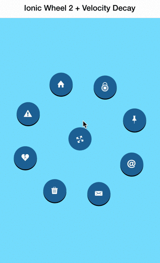

Ionic Wheel 2 + Velocity Decay
===================

This is Part Deux of a module called Ionic Wheel but this time incorporating velocity decay on *dragend*,
also known as the event that occurs after a user swipes their digit across the screen.

The same general components (a rotating wheel on user drag) as the original Ionic Wheel but its internal workings
have been refactored to be cleaner and to include the aforementioned velocity decay. The velocity decay
is accomplished using the [Collide](https://github.com/driftyco/collide) animation engine which is included
as a bower dependency.

Here's the [Codepen Demo](http://codepen.io/loringdodge/pen/vLXmKW)

Here's a quick [Blog Post]()

And here's the original [Ionic Wheel](https://github.com/loringdodge/ionic-wheel)



## Usage

Get the package from bower.

```
$ bower install ionic-wheel-2
```

Include ```ionic-wheel-2.css``` and ```ionic-wheel-2.js``` to your app and remember to include the ```ionic.wheel``` module as a dependency.

```js
angular.module('starter', ['ionic', 'ionic.wheel'])
```

There are two directives included in the ```ionic.wheel``` module. ```ion-wheel``` should encapsulate all menu items you'd like to include in the wheel
and ```ion-wheel-item``` should be used for every individual menu item. In the the example included in this repo
and in the codepen, ```ion-wheel-item wraps a different icon meant to represent a different potential route.

```html
<ion-wheel>
  <div id="activate" ng-click="showCircles()"><i ng-class="circlesHidden ? 'ion-arrow-expand' : 'ion-arrow-shrink'"></i></div>
  <ion-wheel-item><i class="icon ion-home"></i></ion-wheel-item>
  <ion-wheel-item><i class="icon ion-alert-circled"></i></ion-wheel-item>
  <ion-wheel-item><i class="icon ion-heart-broken"></i></ion-wheel-item>
  <ion-wheel-item><i class="icon ion-trash-a"></i></ion-wheel-item>
  <ion-wheel-item><i class="icon ion-email"></i></ion-wheel-item>
  <ion-wheel-item><i class="icon ion-at"></i></ion-wheel-item>
  <ion-wheel-item><i class="icon ion-pin"></i></ion-wheel-item>
  <ion-wheel-item><i class="icon ion-lock-combination"></i></ion-wheel-item>
</ion-wheel>
```

The module already takes care of positioning each ```ion-wheel-item``` around the perimeter of the circle as it did in the original Ionic Wheel
and also adds a drag listener so that a user can rotate the wheel. The most significant addition, apart from the refactor, is this snippet of code
that takes the ```velocityX``` and ```velocityY``` properties of the Ionic specific gesture object. It's used to calculate the distance and then triggering
an animation if the velocity is above ```0.5```. Rather then using the ```.start()``` event, we'll use ```.velocity(velocity)``` which simulates decaying velocity.


```js
onDragEnd: function(e) {
  var self = this;

  var velocity = e.gesture.velocityX + e.gesture.velocityY / 2,
      distance = velocity * 200;

  if(velocity > 0.5) {
    self._animation = collide.animation()

    .on('start', function() {
      self._inProgress = true;
    })

    .on('step', function(v) {
      distance = distance*0.95;
      var animateAngle = (self._currentAngle > 0) ? (self._currentAngle + (-distance)) : (self._currentAngle + (distance));
      self.el.style.transform = self.el.style.webkitTransform  = 'rotate(' + animateAngle + 'deg)';
    })
    .on('complete', function() {
      self._inProgress = false;
      self._originalAngle = self._currentAngle;
    })

    .velocity(velocity)
  }
},
```