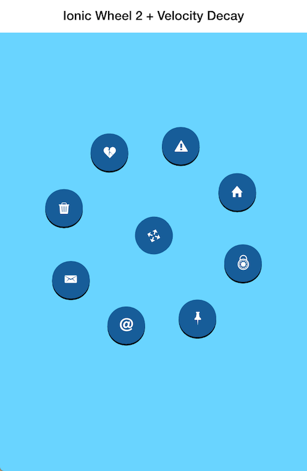

Ionic Wheel 2 + Velocity Decay
===================

This Ionic directive generates a circular menu from a collection of elements that spin on drag.
This directive is free to be used by whomever for whatever reason and has been created for demonstration purposes, meaning
it may interest people wanting to create similar functionality in their own modules.
After all, it was built borrowing knowledge imparted by awesome people sharing their answers on Stack.

Here's the [Codepen Demo](http://codepen.io/loringdodge/pen/vLXmKW)

Here's a quick [Blog Post]()



## Usage

Get the package from bower.

```
$ bower install ionic-wheel-2
```

Just include ```ionic-wheel-2.css``` and ```ionic-wheel-2.js``` to your app and remember to include the ```ionic.wheel``` module as a dependency.

```js
angular.module('starter', ['ionic', 'ionic.wheel'])
```

Next, use the ```ion-wheel``` directive to declare a new instance of the wheel and be sure to define the center element with an id of ```#activate```
and any menu items with a class of ```.circle```. These are both referenced inside the directive and are required for the directive to perform as expected.

```html
<ion-wheel>
  <div id="activate" ng-click="showCircles()"><i ng-class="circlesHidden ? 'ion-arrow-expand' : 'ion-arrow-shrink'"></i></div>
  <ion-wheel-item><i class="icon ion-home"></i></ion-wheel-item>
  <ion-wheel-item><i class="icon ion-alert-circled"></i></ion-wheel-item>
  <ion-wheel-item><i class="icon ion-heart-broken"></i></ion-wheel-item>
  <ion-wheel-item><i class="icon ion-trash-a"></i></ion-wheel-item>
  <ion-wheel-item><i class="icon ion-email"></i></ion-wheel-item>
  <ion-wheel-item><i class="icon ion-at"></i></ion-wheel-item>
  <ion-wheel-item><i class="icon ion-pin"></i></ion-wheel-item>
  <ion-wheel-item><i class="icon ion-lock-combination"></i></ion-wheel-item>
</ion-wheel>
```

The directive takes care of positioning the menu items along the perimeter of the circule and making sure they are equadistant to one another.
It also creates a drag event listener that spins when a user drags the screen with their finger (on mobile).

Not incorporated in the directive but easily created is the ability to hide the menu items on click of the ```#activate``` element. This is how it is
implemented inside the demo and can be achieved with the above markup and the inclusion of the following to an outlying controller.

```js
angular.module('starter', ['ionic', 'ionic.wheel'])

.controller('MainCtrl', function($scope) {

  var circles = document.getElementsByClassName('circle');

  $scope.circlesHidden = true;

  $scope.showCircles= function() {
    var $circles = angular.element(circles);
    if ($scope.circlesHidden) {
      $circles.addClass('active');
    } else {
      $circles.removeClass('active');
    }
    $scope.toggleCirclesHidden();
  };

  $scope.toggleCirclesHidden = function() {
    return $scope.circlesHidden = !$scope.circlesHidden;
  };

});
```